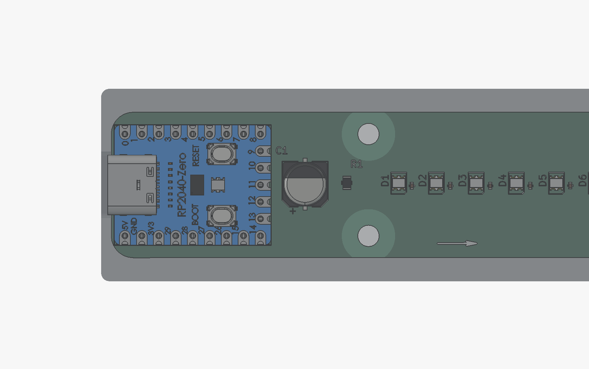
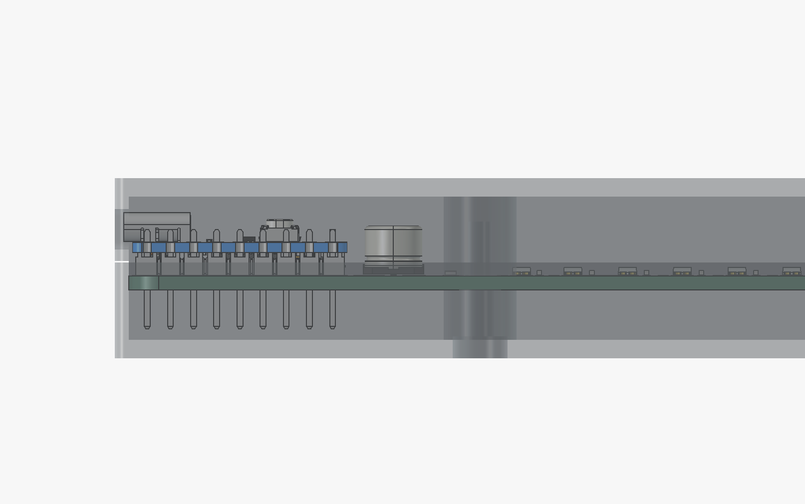
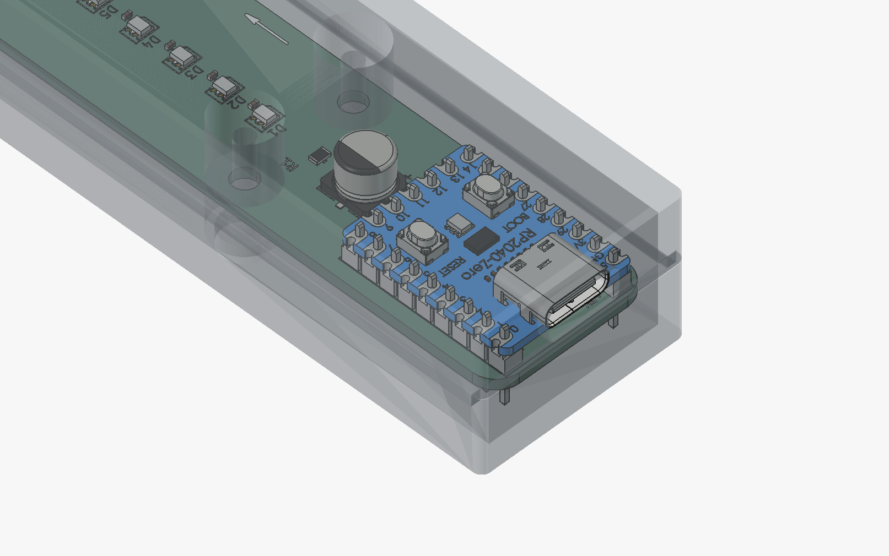
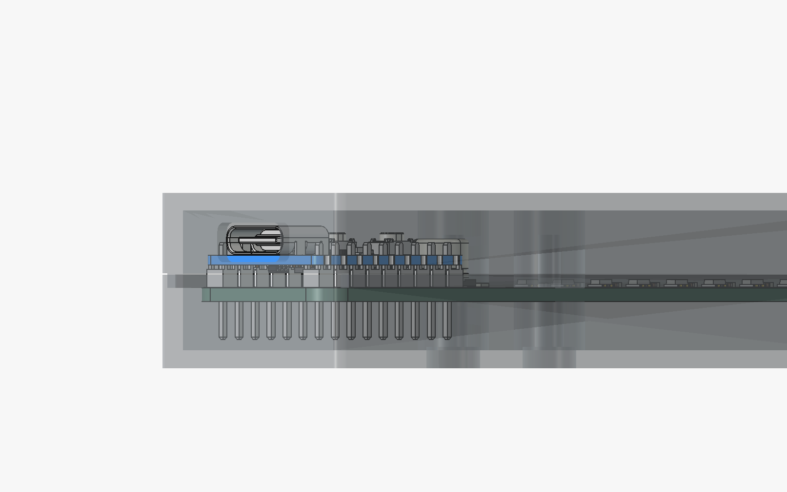

# Agent Andon Light

A physical desktop status light for Claude Code / CLI coding agents — so you can walk away while an agent works and still know its state at a glance, instead of staring at a terminal.

| | | | |
| :---: | :---: | :---: | :---: |
|  |  |  |  |

| Color | Meaning |
| --- | --- |
| Green | Agent working |
| Yellow | Waiting on you (permission or input) |
| Red | Idle / stopped / session ended |
| Flashing green | Compacting (internal maintenance, still alive) |
| Slow pulsing red | Stale / disconnected (device hasn't heard from the host in 30 min) |

This doc covers "I already have the hardware, how do I get it running." Building the hardware from scratch starts at [`device/docs/USER-GUIDE.md`](device/docs/USER-GUIDE.md).

## What You Need

- A Waveshare RP2040-Zero, hand-soldered directly onto the custom PCB (`device/hardware/`).
- A data-capable USB-C cable.
- Arduino IDE (one-time, to flash the firmware).
- Python 3 (one-time, to install the host CLI — Windows users can skip this, see below).

## Quick Start

**1. Flash the firmware.** Open `device/firmware/andon_light_firmware/andon_light_firmware.ino` in Arduino IDE, select board "Waveshare RP2040-Zero," and upload. Full steps: [`device/firmware/README.md`](device/firmware/README.md).

**2. Install the host CLI.**

| OS | How |
| --- | --- |
| Linux | `pipx install andon-light` — see [`packaging/linux/README.md`](packaging/linux/README.md) |
| Windows | Download and run the installer — see [`packaging/windows/README.md`](packaging/windows/README.md) |

Confirm it can see the board:

```txt
andon-light doctor
```

**3. Wire up the Claude Code hooks:**

```txt
andon-light install-hooks
```

Shows you the exact hook config before touching anything, then merges it into `~/.claude/settings.json` (or a single project's config) once you confirm. Rationale for each hook mapping: [`hooks/README.md`](hooks/README.md).

**4. Restart Claude Code** (or start a new session) — hook config changes don't apply to a session already running.

From here the light tracks your session automatically — no manual commands needed day to day.

## Manual Control

Useful for testing, or to set the light by hand:

| Command | Effect |
| --- | --- |
| `andon-light set working` | Solid green |
| `andon-light set waiting` | Solid yellow |
| `andon-light set idle` | Solid red |
| `andon-light set compacting` | Chase-fill (compacting) |
| `andon-light heartbeat` | Keepalive, no color change |
| `andon-light doctor` | Detect the device and report its port |

## Troubleshooting

See [`device/docs/TROUBLESHOOTING.md`](device/docs/TROUBLESHOOTING.md) for the full diagnostic playbook, covering both Windows and Linux.

## Documentation

```txt
agent-andon-light/
├── device/
│   ├── docs/
│   │   ├── BOM.md               parts list
│   │   ├── USER-GUIDE.md        build guide — soldering, wiring, glossary
│   │   └── TROUBLESHOOTING.md   diagnostic playbook
│   └── firmware/README.md       firmware setup & wire protocol
├── host/README.md               CLI development & usage
├── hooks/README.md              Claude Code hook mapping & rationale
└── packaging/
    ├── linux/README.md          Linux install
    └── windows/README.md        Windows installer build & test
```

An earlier hardware iteration (3 discrete LED bulbs instead of an addressable strip) is preserved for reference at [`archive/led-bulb-mvp/README.md`](archive/led-bulb-mvp/README.md) — not part of the current build.

## Status

5 units built and tested — custom PCB, 3D-printed enclosure, firmware, host CLI, and Claude Code hooks all confirmed working end to end. Published on PyPI; a one-click Windows installer is available.
